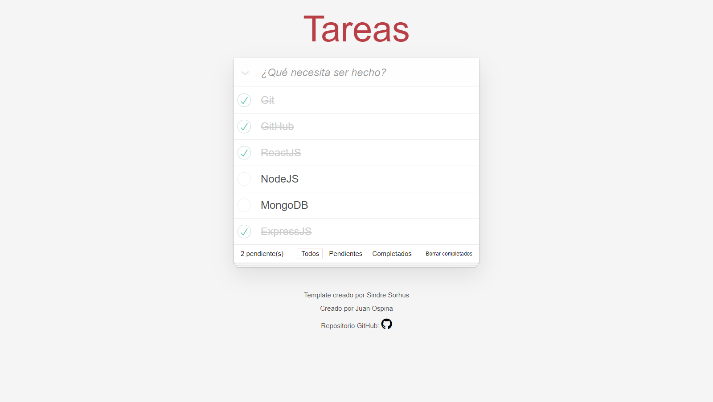

# To Do List

Esta aplicación está realizada con HTML/CSS y JavaScript utilizando LocalStorage para almacenar las tareas que agregues.

## Notas

### 1: Reconstruir los módulos de Node.

```
npm install
```

### 2: Reconstruir el build.

```
npm run build
```

### 2: Ejecutar proyecto.

```
npm start
```

## Probar Proyecto: https://ospinajuan2000.github.io/todo-list/

## Funcionalidad.

### Puedes insertar tareas, eliminar tareas, mostrar las pendientes, mostrar y/o mostrar las terminadas. Aplicación construida usando Local Storage.

<div style="background-image: url('./src/assets/img/cubes.png'); display: block; margin: 0 auto;">
    
    
</div>
